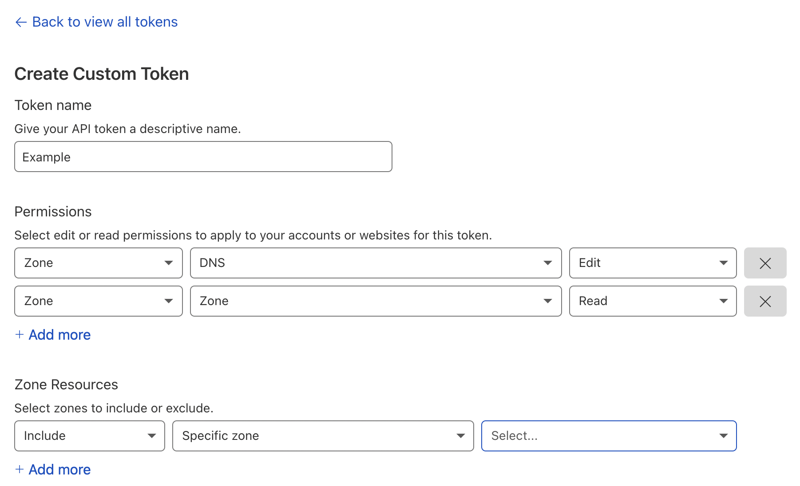

## Cloudflare DDNS Updater

This docker image gives you the ability to update a Cloudflare DNS record via the API to manage your DDNS on a homelab.

### Creating Cloudflare Token

Follow the guide here for creating a token: https://developers.cloudflare.com/api/tokens/create

Your token needs to have the following permissions:



### Configurations

This script uses the following environment variables for configurations.

| Environment Variables | Description | Example | Required |
|-----------------------|-------------|---------|----------|
| CLOUDFLARE_TOKEN      | The API token for interacting with Cloudflare. | AbCdEf12345 | Yes |
| CLOUDFLARE_ZONE      | The Cloudflare zone you want to update. | example.com | Yes |
| CLOUDFLARE_RECORD      | The Cloudflare record you want to update | *.example.com | Yes |
| CLOUDFLARE_DNS_TTL | The TTL (in minutes) for the DNS entry. | 1 | No |
| INTERVAL_MINS | The interval (in minutes) you want the updater to run. | 5 | No |
| IP_URL | URL to acquire your public IP. Must return IP in plain-text. | https://checkip.amazonaws.com/ | No |
| LOG_LEVEL | Level for logging (info, debug, warning) | info | No |

### Running from Docker Compose

1. Go into the Docker deploy directory: `cd deploy/docker`
2. Modify the `docker-compose.yaml` file with your configurations.
3. Run `docker-compose up -d`
4. Check logs of the container with: `docker logs -f cloudflare-updater`

### Running in Kubernetes

1. Go into the K8s deploy directory: `cd deploy/k8s`
2. Copy the `secret.yaml.example` and `configmap.yaml.example` files:
    ```bash
    cp secret.yaml.example secret.yaml
    cp configmap.yaml.example configmap.yaml
    ```
3. Update `secret.yaml` and `configmap.yaml` to your specific values.
4. Ensure you're pointing at the right Kubernetes cluster: `kubectl cluster-info`
5. Apply the manifests: `kubectl apply -f .`